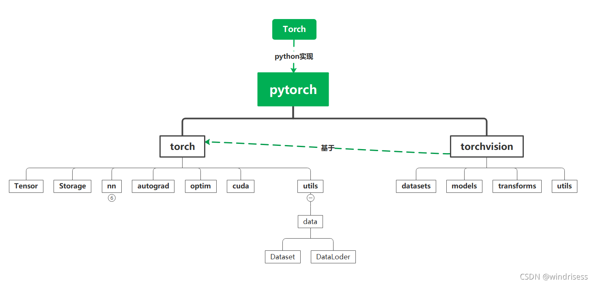
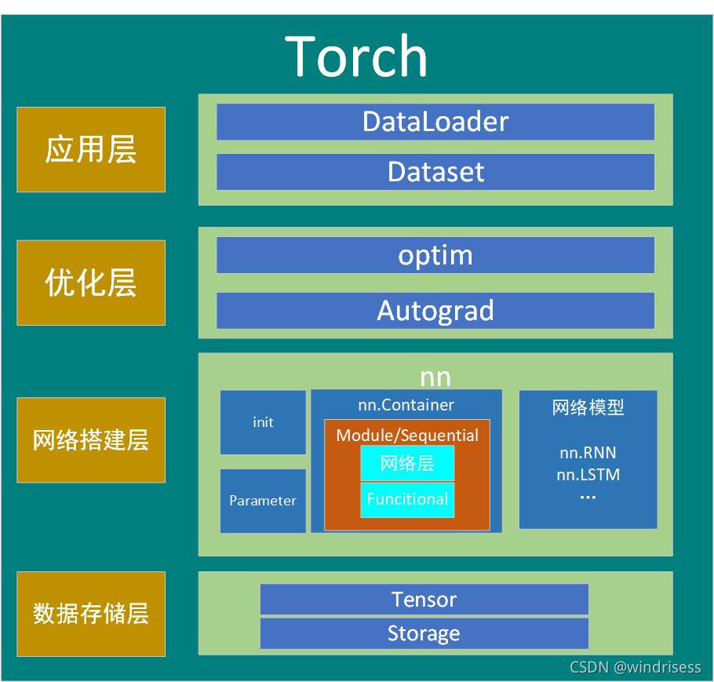

- [1. 基本架构](#1-基本架构)
  - [1.1. torch.Tensor](#11-torchtensor)
  - [1.2. torch.Storage](#12-torchstorage)
  - [1.3. torch.nn](#13-torchnn)
    - [1.3.1. 包含多种子类](#131-包含多种子类)
    - [1.3.2. 容器(Containers)](#132-容器containers)
    - [1.3.3. 网络层](#133-网络层)
    - [1.3.4. 搭建好的网络](#134-搭建好的网络)
  - [1.4. torch.autograd](#14-torchautograd)
  - [1.5. torch.optim](#15-torchoptim)
  - [1.6. torch.cuda](#16-torchcuda)
  - [1.7. torch.utils](#17-torchutils)
  - [1.8. torchvision](#18-torchvision)
  - [1.9. 总结](#19-总结)

# 1. 基本架构

## 1.1. torch.Tensor

- 定义tensor类型，包含7种CPU tensor类型和8种GPU tensor类型（整型、浮点型）（8/16/32/64位）
- 实现基于Tensor的各种数学操作、各种类型的转换。比如相加、相乘、求绝对值等

## 1.2. torch.Storage

管理Tensor地存储

比如是以byte还是char类型存储在计算机中，就由这个库来管理。
以CPU类型还是GPU类型存储。一般情况以CPU类型存储，想要用cuda加速的话必须把模型和数据同时以GPU类型存储。 变量名.cuda()

## 1.3. torch.nn

### 1.3.1. 包含多种子类

- torch.nn.Parameter()：Variable的子类，用于管理网络的参数，默认requires_grad=True.
- torch.nn.functional：集合了损失函数，激活函数，标准化函数等函数
  torch.nn.init：初始化各种参数

### 1.3.2. 容器(Containers)

- --torch.nn.Module：--所有网络的基类，操作者的模型也应该继承这个类。继承后自动注册该网络。
- --torch.nn.Sequential：--时序容器，可以更方便的搭建网络，把已有的网络层往里面放即可。

### 1.3.3. 网络层

- torch.nn.Linear：全连接层
- torch.nn.Conv1\2\3d：卷积层，有一维二维三维
- torch.nn.XXXPool1\2\3：池化层，最大池化、平均池化等等，一维二维三维### 函数包：
- torch.nn.functional
- torch.nn.functional.(Activations)：激活函数，包括ReLU、softmax等

- torch.nn.functional.Nomalization：标准化（归一化）层，1d2d3d
- torch.nn.functional.LossFunctions：损失函数，L1Loss、MSELoss(均方误差)、CrossEntropyLoss(交叉熵)…

### 1.3.4. 搭建好的网络

- torch.nn.RNN：卷积神经网络
- torch.nn.LSTM：长短期记忆人工神经网络

## 1.4. torch.autograd

- 主要功能：对可求导的Variable变量进行求导。

## 1.5. torch.optim

- optim是什么：一个实现了各种优化算法的库。
- 主要功能：对需要优化的参数（必须是Variable对象）进行求导。

## 1.6. torch.cuda

- 主要功能：实现了与CPU张量相同的功能，但使用GPU进行计算。

## 1.7. torch.utils

- torch.utils.data.Dataset:
主要功能：创建、保存数据集。
- torch.utils.data.DataLoder:
主要功能：包含对数据集的一些操作，比如batch操作(每次取数据集中的一小批)，shuffle操作(随机取样)。

## 1.8. torchvision

- 简介：包含了目前流行的数据集，模型结构和常用的图片转换工具。其实是基于pytorch中的torch实现的图像处理包。

## 1.9. 总结

