- [1. 课堂内容](#1-课堂内容)
  - [1.1. 元件布局原则](#11-元件布局原则)
  - [1.2. 元件布线原则](#12-元件布线原则)
  - [1.3. 覆铜](#13-覆铜)
  - [1.4. 图形符号和注释性字符](#14-图形符号和注释性字符)
  - [1.5. 丝印摆放](#15-丝印摆放)
  - [1.6. 查看3D视图](#16-查看3d视图)
  - [1.7. 注意事项](#17-注意事项)
- [2. 基础原件](#2-基础原件)
  - [2.1. 电阻元件](#21-电阻元件)
  - [2.2. 电容原件](#22-电容原件)
  - [2.3. 电感](#23-电感)
  - [2.4. 二极管](#24-二极管)
  - [三极管](#三极管)
  - [场效应管](#场效应管)
- [布线](#布线)
  - [布线要求](#布线要求)
  - [布线顺序](#布线顺序)
  - [视频教程](#视频教程)

# 1. 课堂内容

## 1.1. 元件布局原则

- 先大原件再小原件
- 尽量放在同一层
- 根据信号主流向安排主要原件
- 部分可采取对称式
- 总线和关键信号线短
- 高压，大电流与低压，小电流要分开
- 模拟与数字分开
- 高低频信号要分开
- 发热的原件均匀分布
- 温度敏感元件原理发热大的元件
- 元件排列要便于日后维修

## 1.2. 元件布线原则

- 根据电流设计线宽和线长
- 不应该过细，最低10mil
- 拐弯处一般是135°圆角或钝角，不能走锐角，尽量不走直角
- 同一层导线方向一致
- 不同层导线尽量相互垂直
- 不同层导线连接必须过孔
- 先布要求高的线，再布要求低的线
- 地线铺铜

## 1.3. 覆铜

- 一般把铜线接地
  作用：

1. 减小地线阻抗，提高抗干扰能力
2. 降低压降，提高电源利用效率
3. 减小环路面积

- 实心铺铜vs网格普通

1. 实心适合大电流，但过波峰焊会导致电路板变形
2. 网格对于高频电路效果好

- 模拟地和数字地要分开，单点连接
- 晶振周围要环绕铺铜
- 天线周围不能铺铜

## 1.4. 图形符号和注释性字符

## 1.5. 丝印摆放

- 丝印不能放在过孔，焊盘上(放不上)
- 一般放在元件旁边
- 丝印不应该放在元件下方，避免元件焊接后被遮挡
- 保持方向统一性，不要超过两个方向摆放，推荐在左在下

## 1.6. 查看3D视图

- 检查有无元器件封装选择错误、 元器件位置摆放不当、 丝印位置摆放不当

## 1.7. 注意事项

- usb，开关等放在pcb板边上，便于连接
- ISP是备用方案，表贴USB用不了的时候换备用ISP供电
- 收音机竖直放置，所以最下面不能放开关之类的不然立不起来
- 量喇叭尺寸画一个圆表示喇叭尺寸
- 同上，对于电池盒，同时使用胶水粘住
- 有两个元件放在背面，但也需要有一定支撑使得收音机可以躺着放
- 螺丝2.5mm，pcb的孔大小为2.5mm-3mm，螺丝3mm，孔为3-4mm
- 四个灯 ^ef01e5

  - LED1：电源
  - LED2：RSSI 信号强度
  - LED3：自定义
  - LED4：自定义
- 名字有特殊他要求
- 0欧电阻：可以焊接当成导线，也可以不焊接，电路断路，相当于可拆卸导线
- battery不做焊盘直接连接
- 电线焊盘处不铺铜，因为会吸收信号
- 先开孔，再连线
- 数码管上方的小孔（过孔）连接铜的两层，避免孤岛
- 连接焊盘处是有钝角的
- PCB做完后要进行DRC，检查结果在设计管理器中
- ISP中GND引脚在下边
- 红色加粗的线是电源线
- 下面为加粗的线，代表可能需要的线可能流过大电流!
- 不建议用黑色或者白色，因为看不出来
- 不需要生产稿

---

# 2. 基础原件

## 2.1. 电阻元件

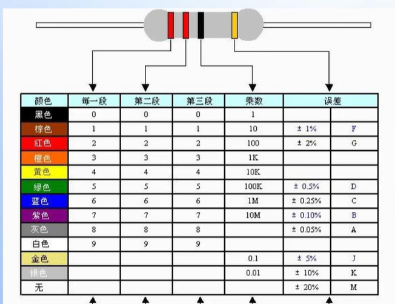

- 四段:1，2是数值，3是乘数，4是误差
- 五段：1，2，3是数值，4是乘数，5是误差

## 2.2. 电容原件

- 通交流阻直流
- 储能和滤波
- 分为贴片和插件电容
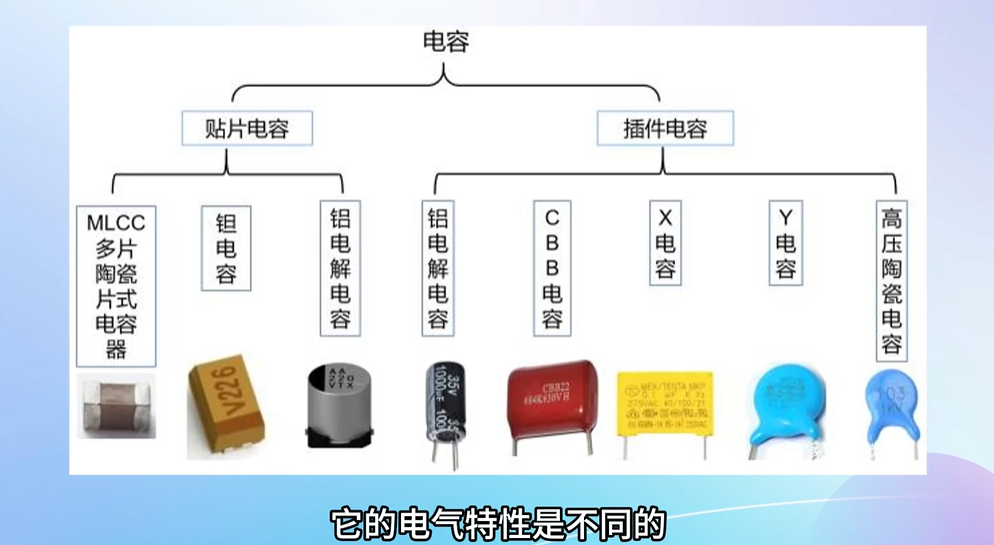
- 钽电容和铝电解电容
- 铝电解电容（直插）白色竖线对应的负极
- 铝电解电容灰色（贴片）对应的是负极
- 钽电容前两位是数值位，最后一位是次方（负的）
- 钽电容耐压值与字母
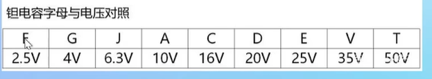
- 钽电容侧边一侧有深的杠的是正极
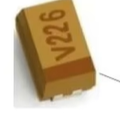
- s极是正极，d极是负极性
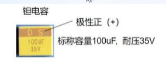
- X电容标注比较清楚
- CBB电容读书与钽电容类似
- 瓷片电容读数与钽电容类似，耐压值默认50V
- 涤纶电容，读数类似，最后一位是误差，前面字母加数字表示耐压值，数字表示次方
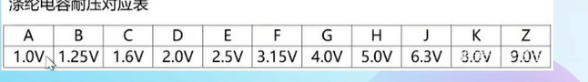

## 2.3. 电感

- 单位是亨利
- 分为贴片电感和插件电感
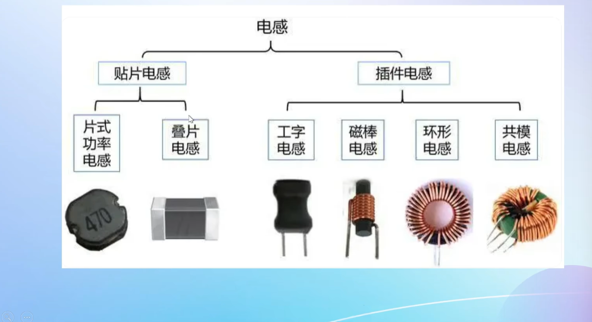
- 色环电感读数与色环电阻一样
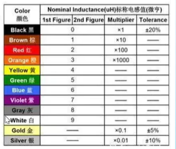
- 片状电阻看顶盖丝印，331代表$33\times10^1$,单位是uF
带字母的表示小数点1R5代表1.5，单位uF

## 2.4. 二极管

- 种类
  1. 普通二极管
  2. 稳压文机关
  3. 发光二极管
  4. 光电二极管（方向不同）
  5. 变容二极管（图像二极管+电容）
  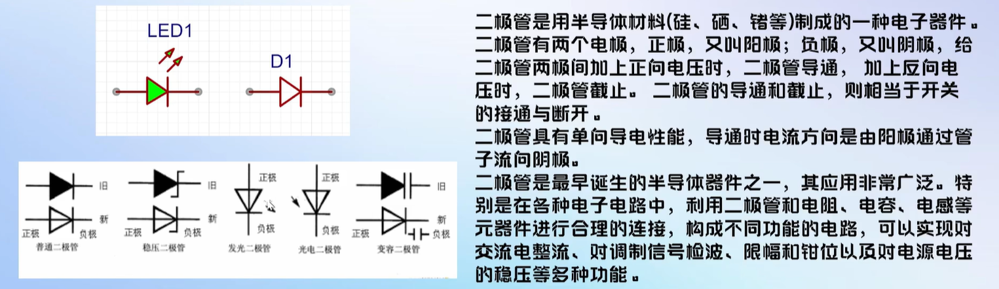
- 导通压降，硅管是0.6~0.8V，锗管是0.2~0.3V，导通压降越小越好
- 电流为0的区域叫死区
- 二极管反向电流很小，不是没有
- 反向电压达到一定程度会被击穿，电流增大
- 各种二极管
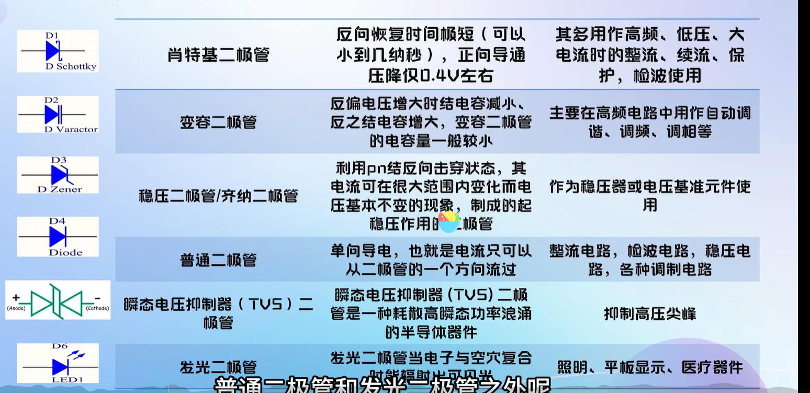
- 发光二极管长脚位正极，短的为负，内部大的（大红旗）的是负极
- 对于贴片二极管，背面有箭头，正面有小点点，是负极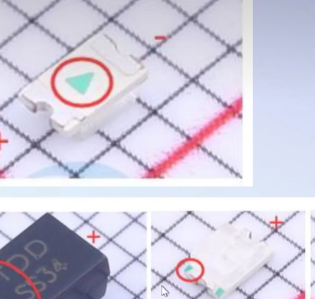
- 插接和贴片有黑线的都是负极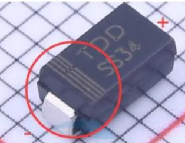
- 丝印
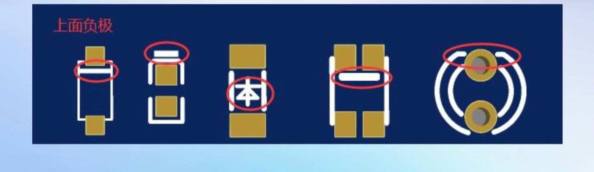

## 三极管

- 分为PNP和NPN，Q1为NPN，Q2为PNP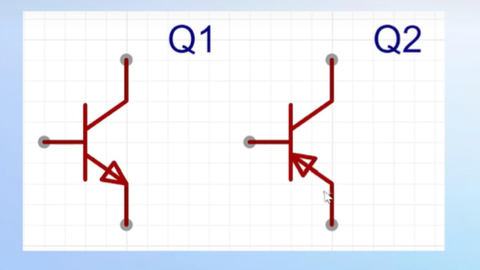
- 区分PNP和NPN：箭头是由P指向N的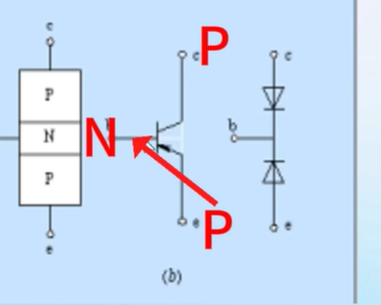
- 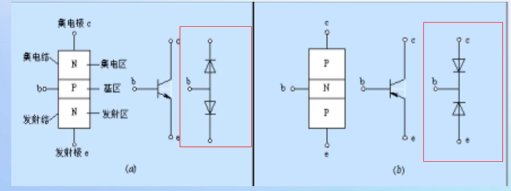
- 三极管的输出特性
  - 基极b电流大，集电极c通过的电流越大，类似于基极b是一个阀门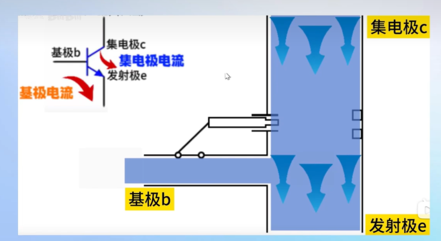
- 分为三个状态，截止状态，饱和状态，放大状态
  - 截止状态：电流为0，三极管不导通
  - 放大状态：此时电流$I_c$等于k倍的$I_b$，k成为三极管的放大倍数
  - 饱和状态：三极管完全导通，压降非常小，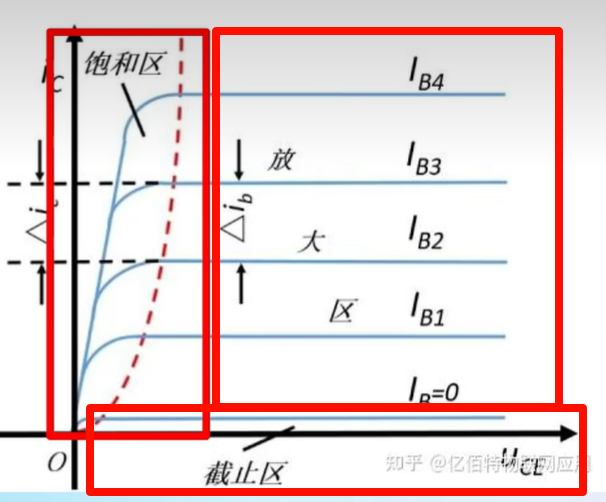
- 封装及其引脚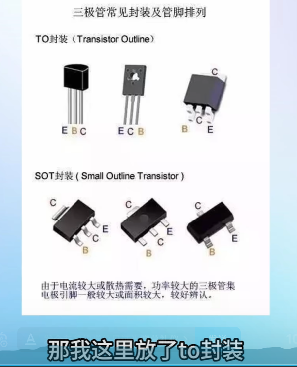

## 场效应管

- 对比
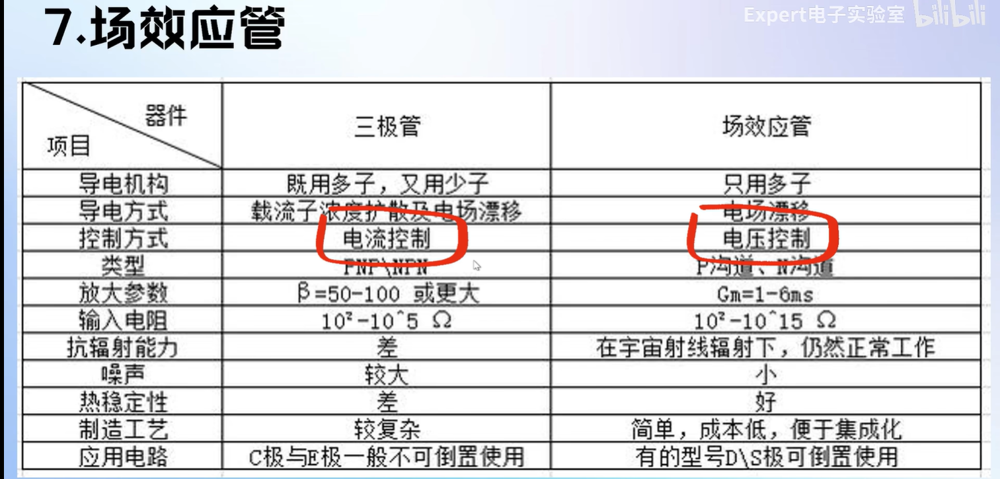
- 四种mos管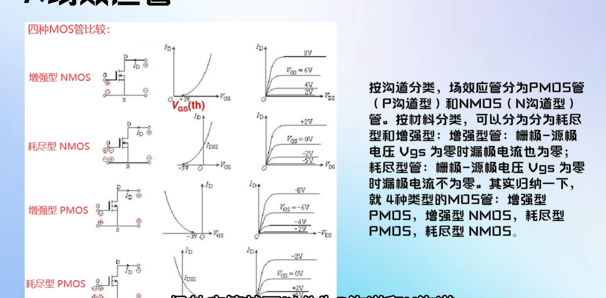
- 不同封装的MOS管允许的电流和电压不同

# 布线

## 布线要求

- 原则上电源线要加粗
- 顶层优先
- 电源与电容：电源经过滤波电容后再接，去耦电容要在芯片旁边
- 高频信号线要短，做好与其他线的隔离，同层信号线尽量避免平行，采用正交，差分线等距等长
- 高频信号（晶振）周围打一圈地过孔!
[🧇](../.images/PCB/image-21.png)
- 3w原则：线长大于三倍线宽
- 布线远离安装孔和电路板边缘
- 需要加泪滴，保护焊盘，使得线与焊盘连接牢固

## 布线顺序

- 关键信号线优先
- 密度优先
- 关键元件优先

## 视频教程

[link](https://www.bilibili.com/video/BV1At421h7Ui/?p=23&spm_id_from=pageDriver&vd_source=4d89518c65a258a7ce956e64e07f344f)
