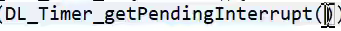
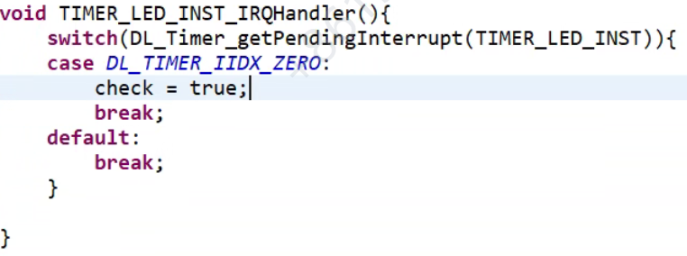
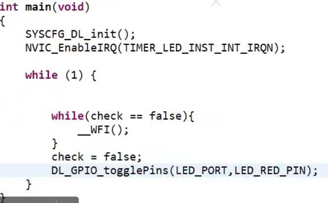
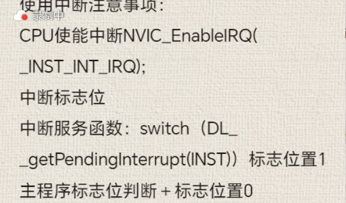
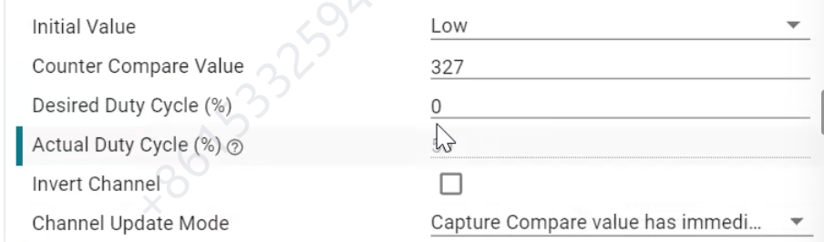
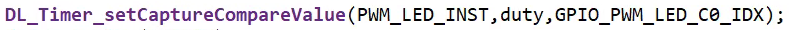

# GPIO

DL_GPIO_clearPins
端口变0

DL_GPIO_togglePins
反转引脚

第一个参数端口号
第二个参数引脚号

DL_GPIO_setPins
设置特定引脚为1

DL_GPIO_writePins
按位写入引脚

SWD是用于调试
的有两根线（SWDIO SWCLK）

delay_cycles()
*延迟多少个时钟周期（32M次为秒）
（但是并不精确，更精确用时钟）*

在sysconfig中开启，不用手动写函数开启了

一个中断可能由多个触发，会有对应
的标志位进行判断由谁判断

获取中断标志位

触发中断调用并判断是否是对应的触发的中断

__WFI(Waiting For Interrupt 低功耗)

TIMER支持PWM

改变比较寄存器，也可以在下面直接填想要的占空比

