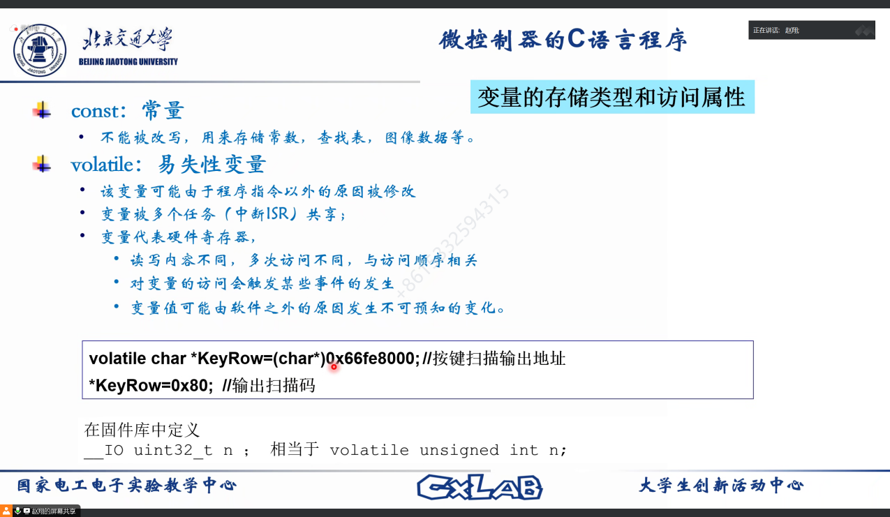
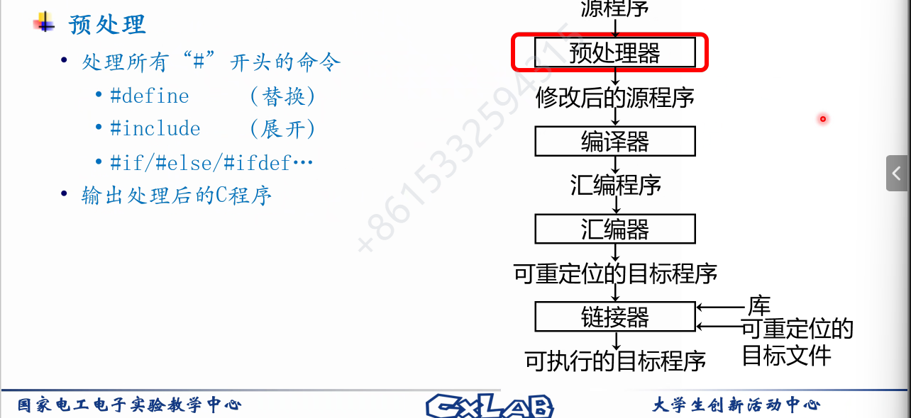
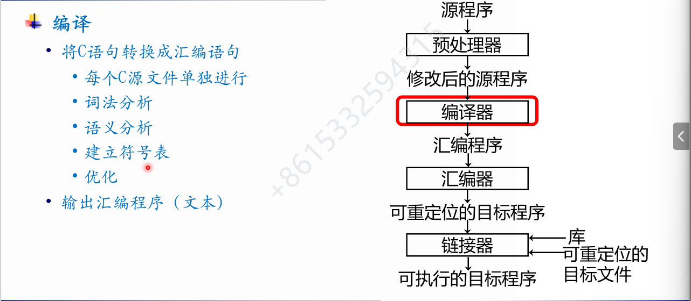
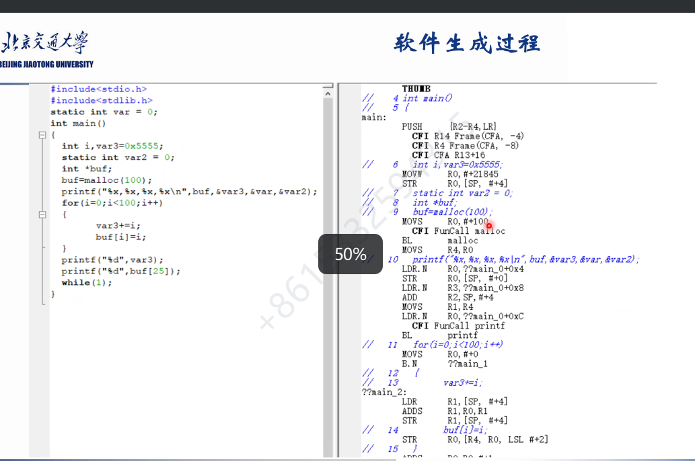
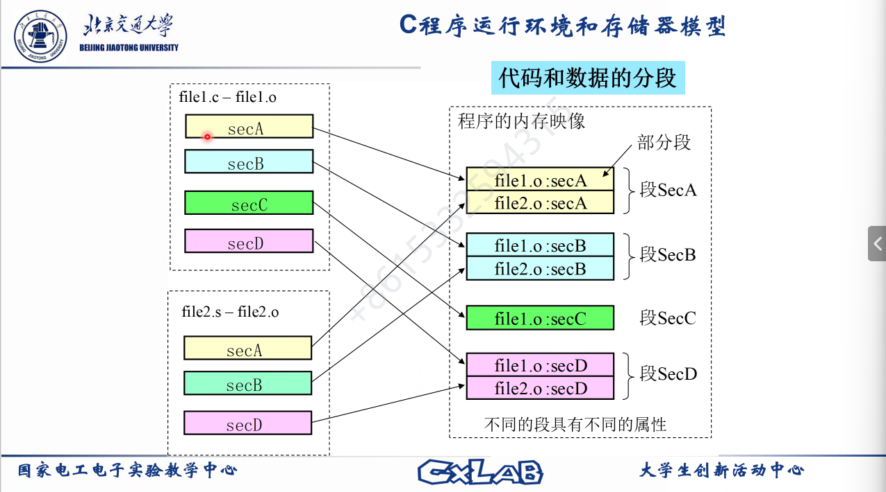
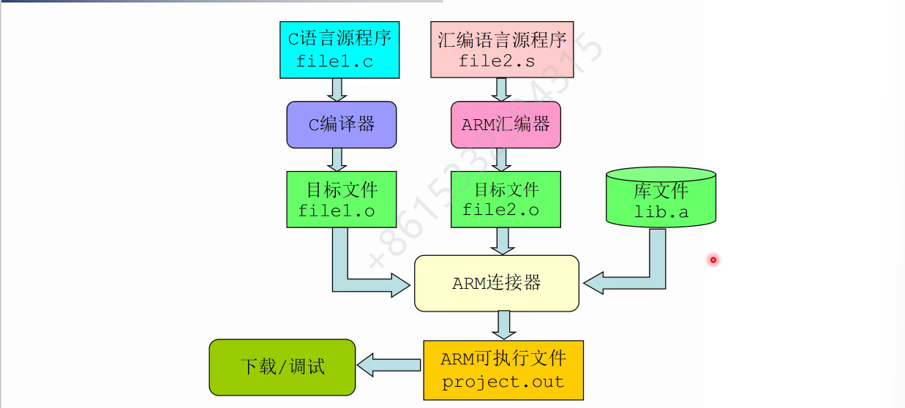

\#开头的都是预处理

\#include本质上就是展开文件（把头文件的内容移动过来），把头文件

头文件不可包含变量，因为每次包括的时候都会声明一次（多次展开），导致变量重定义

编译器会优化，比如if(0)会直接删掉，但是有些情况下会导致错误，可以手动关闭

编译结果

汇编
变为机器码

链接

未定义的引用报错

- 编译错误
- 链接错误

（报错的时候会提示来自哪里）

有仿真器，可以用来调试，51没有调试器，调试会很麻烦