# 图论

- 图的概念

- 图的种类
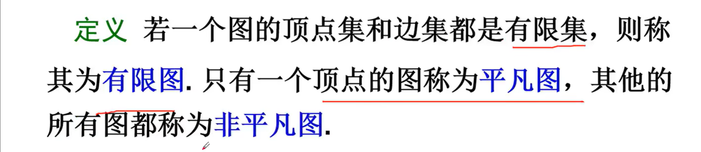
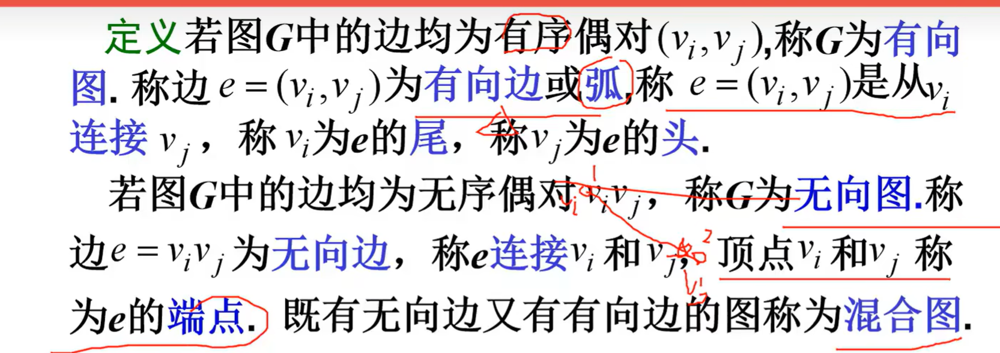

- 常用术语
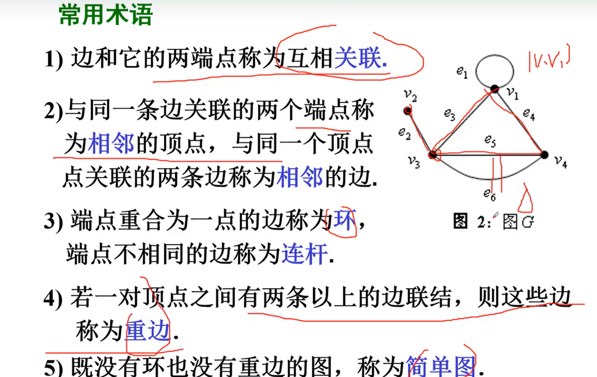
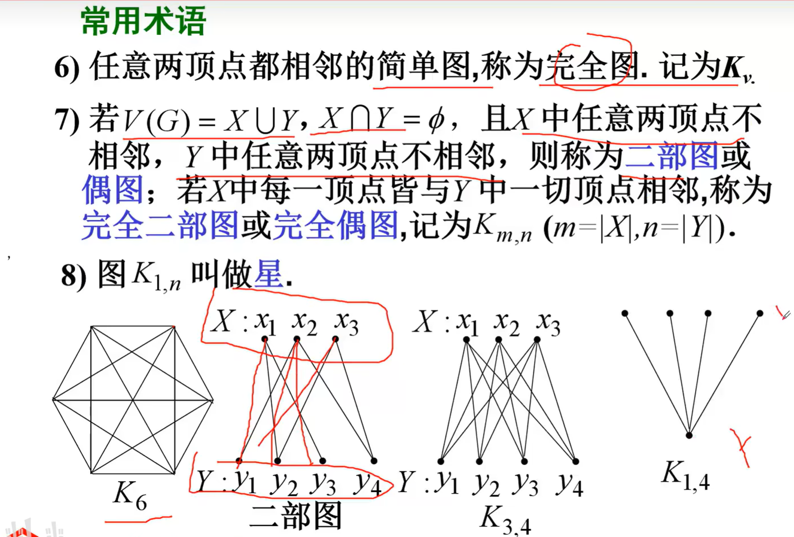

- 赋权图和子图
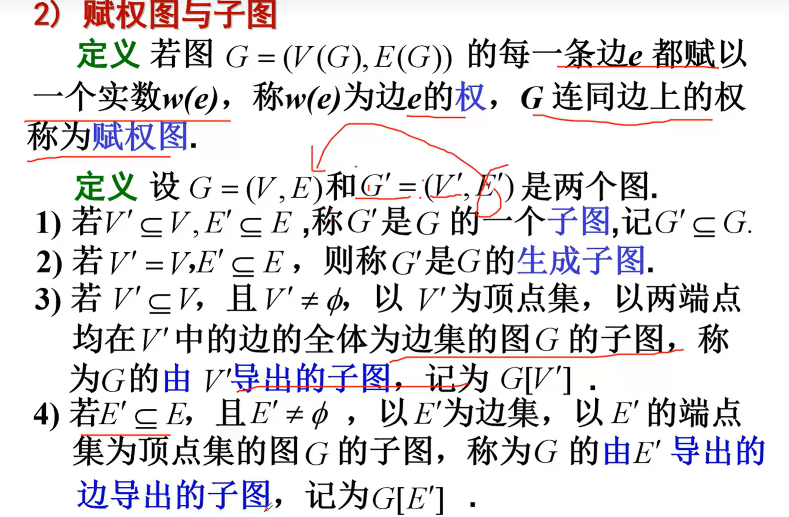

- 矩阵表示
    - 无向图邻接矩阵（一定对称）
    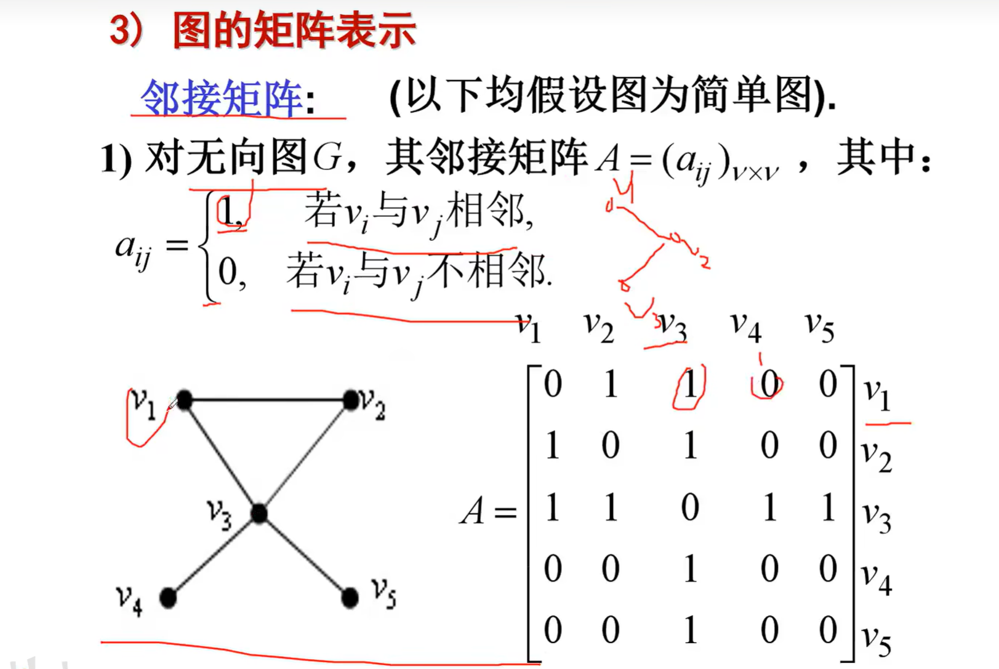
    - 有向图邻接矩阵（不一定对称）
    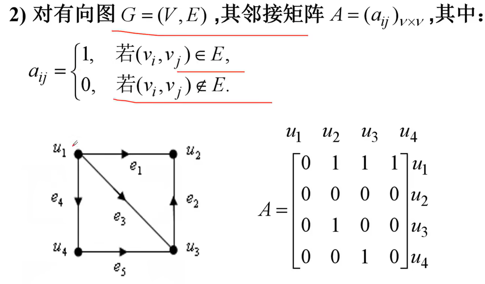
    - 有向赋权图邻接矩阵（无向赋权图类似）
    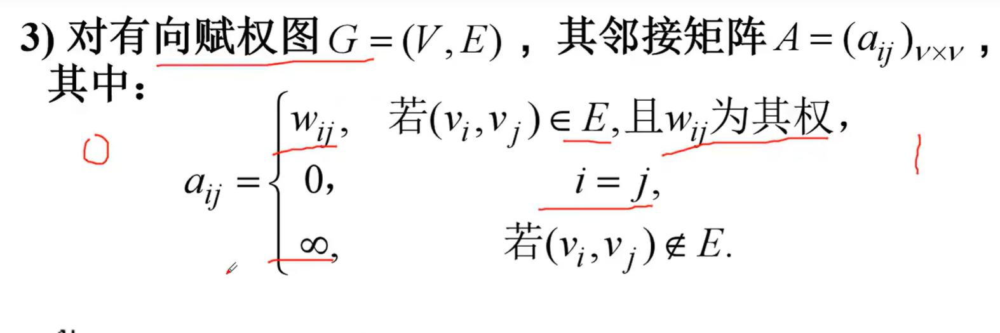
    - 无向图关联矩阵
    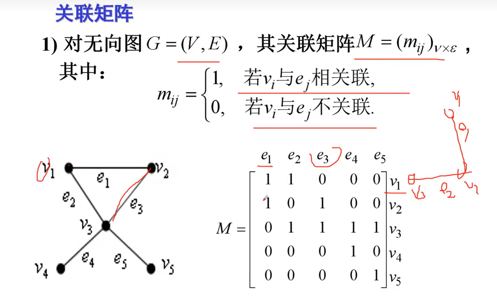
    - 有向图关联矩阵
    - 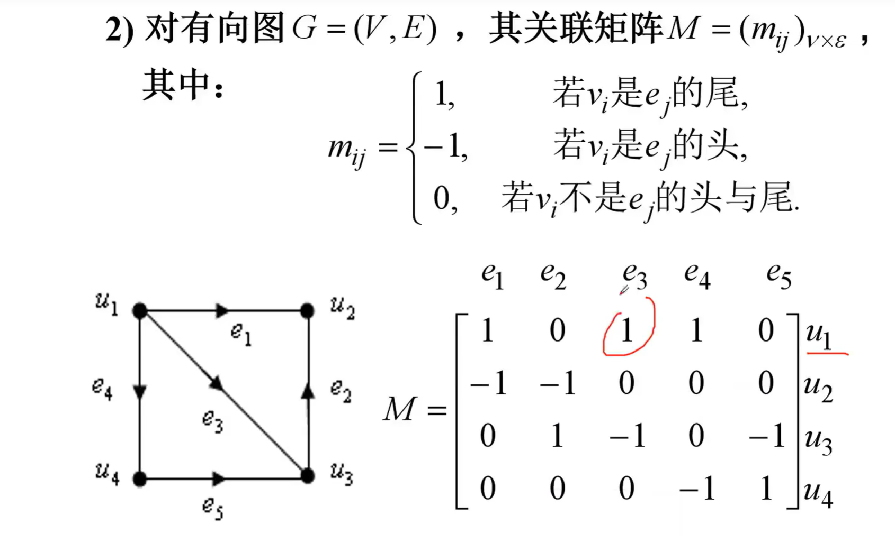
- 顶点度
    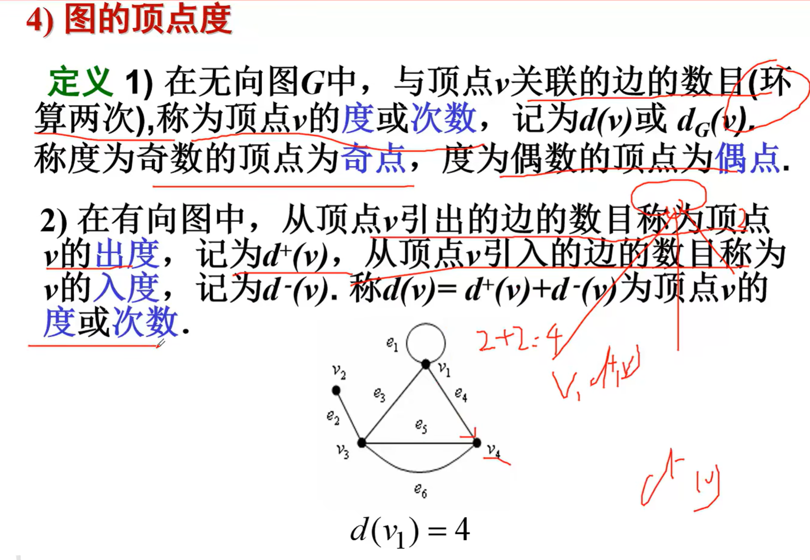
- 路和连通
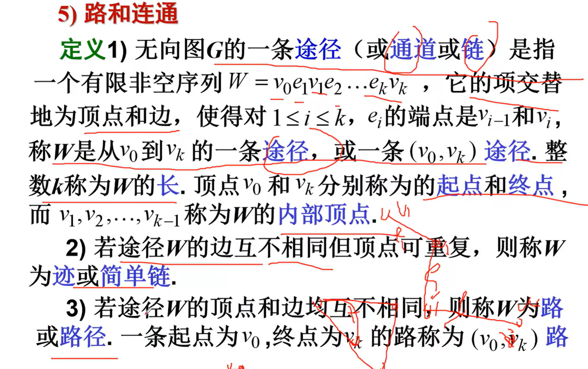
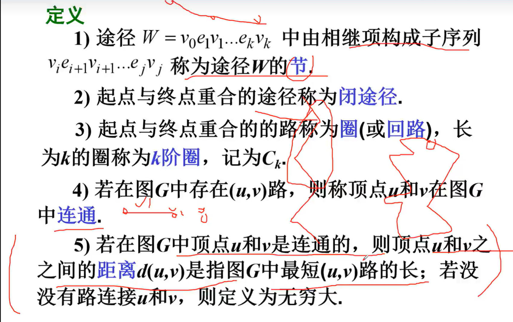
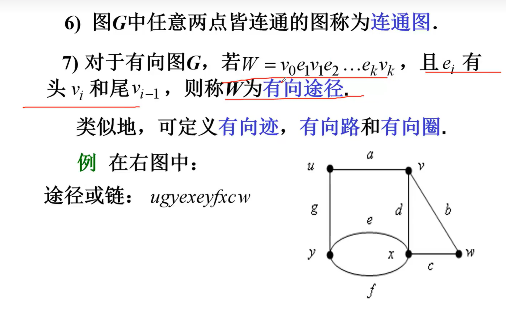
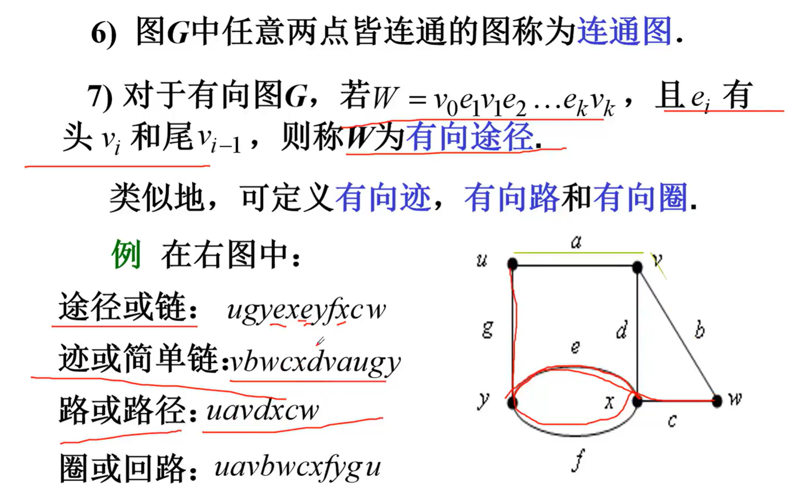
- 最短路问题和算法
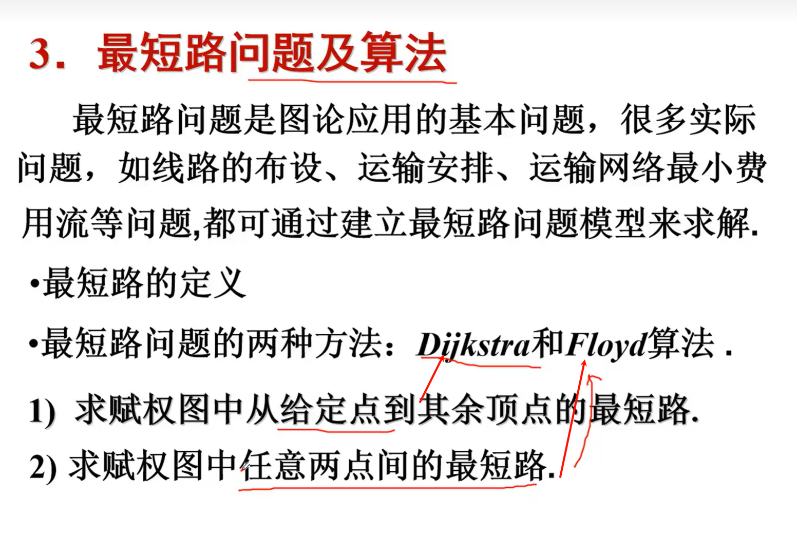

$[ s^2 = \frac{\sum_{i=1}^{n} (x_i - \bar{x})^2}{n-1} ]$