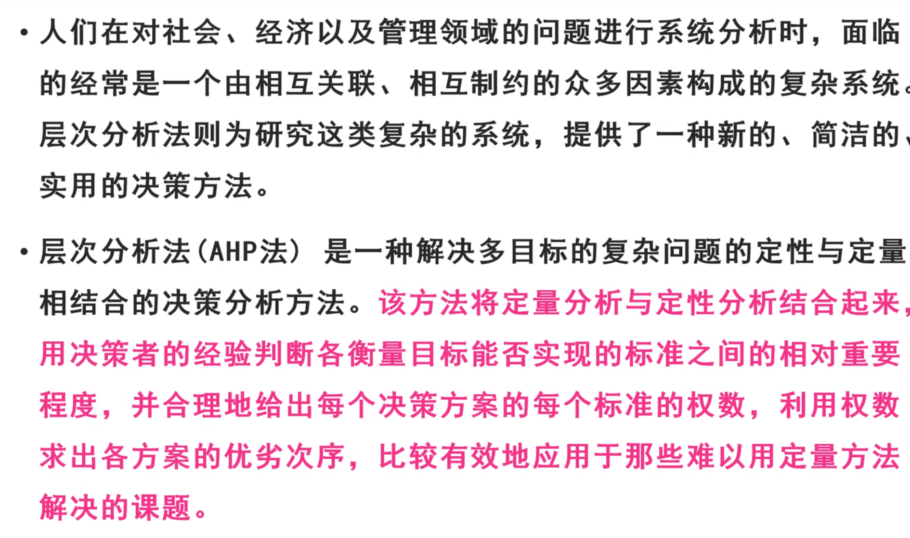
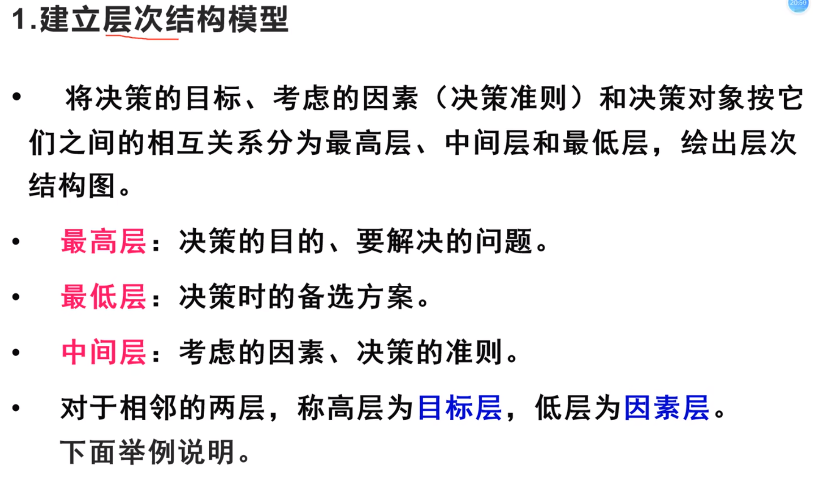
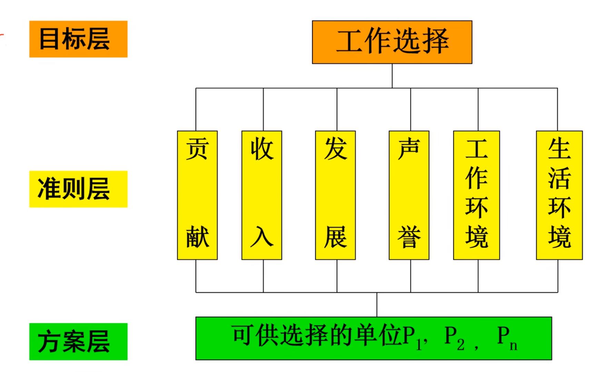
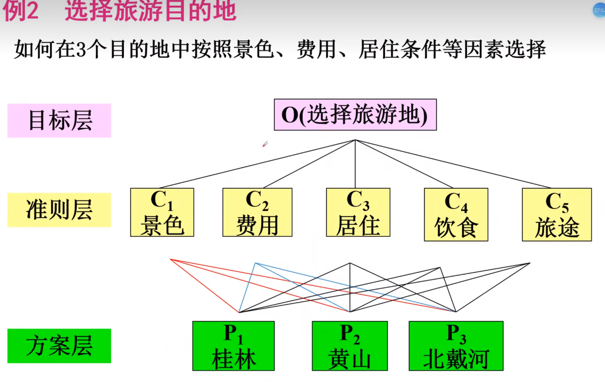
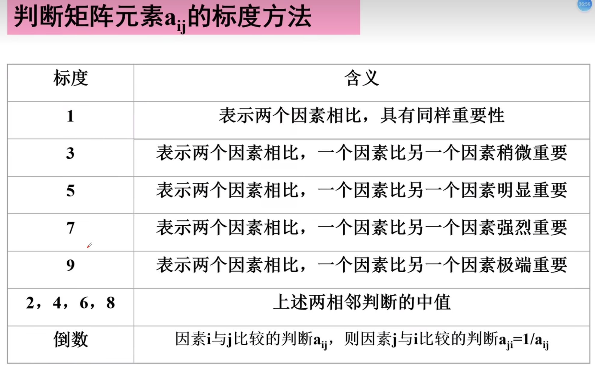

## AHB概述

用于评价决策问题,但是解决的是很难转化为定量的问题

***定量与定性相结合***

***决策过程层次化,数量化***

层次化的三个层次:

***目标层,准则层,方案层***

数量化:用数字代替一遍  

## 三大应用场景
1. 最佳方案的选取(选择旅游景点)
2. 用于评价类问题(评价环境)
3. 用于指标体系的优选(兼顾科学与效率)

## 步骤

### 1.建立层次模型

分为不同层,以确定谁是主要影响因素

***实际问题分层示例:***

***如何分层:***

最高层(目标层): 最终要解决的目标

中间层(准则层,指标层): 具体的中间环节

最低层(方案层): 采取的具体方案

### 2.构造判断(成对比较)矩阵

***特点:***
1. 不把所有因素放在一起,只作两两比较
2. 采用相对尺度(一个比一个怎么样)

***标度方法:***

***总结:*** 

1 3 5 7 9两者差距依次增大,2,4,6,8为中间值

倒数:因素i比因素j $a_{ij}$,因素j比因素i$a_{ji}$,则$a_{ij}=\frac{1}{a_{ji}}$

