# 基础知识

## 1.数据预处理

### 缺失值处理
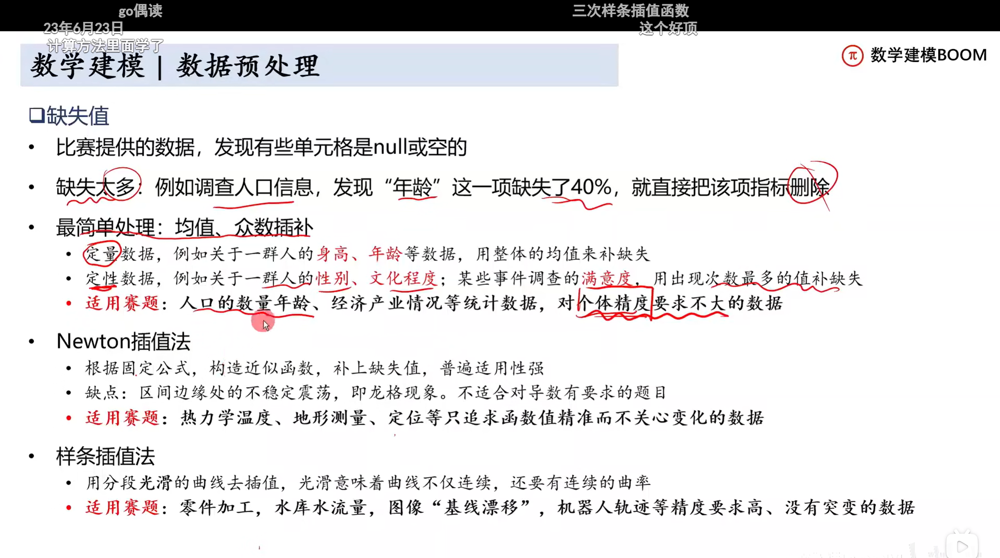
缺失太多数据,直接删掉

简单处理:
1. 对于定量,***采用均值***
2. 对于定性,***采用众数***

复杂处理:

***1.newton插值法***

缺点:会有边缘跳变

***2.样条插值法***

一般两种方式一起用

### 异常值处理
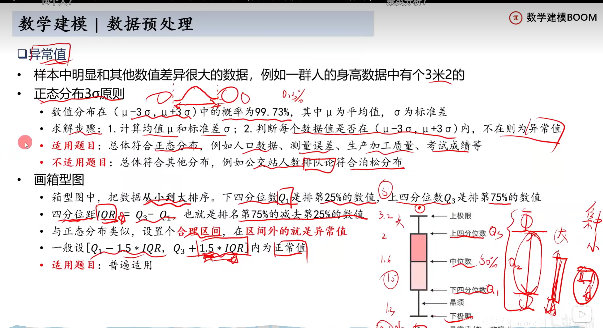
1. 正态分布3$\sigma$原则
2. ***画箱型图:***
   1. Q1=25%处的值,Q3=75%处的值
   2. IRQ=Q3-Q1,
   3. $[Q1-1.5\times IRQ,Q3+1.5\times IRQ]$

## 2.怎么建模
***摘要（最重要）*** 问题重述,模型假设和符号说明,***模型建立与求解(最长)***,模型的优缺点改进与改进方法,参考文献和附录

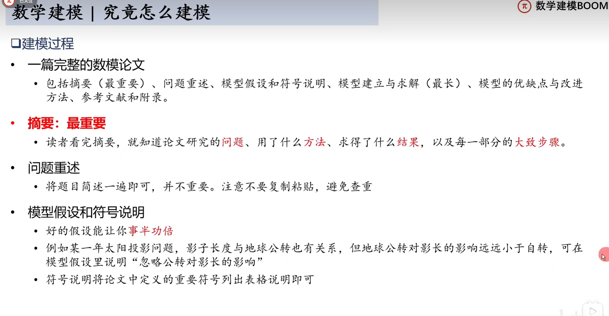

- 摘要: 总的概述,结构清晰的摘要很重要
- 问题重述: 把问题简单重复一遍即可
- 模型假设和符号说明: 省略次要因素,关注主要因素,便于计算
- 模型建立: 先建立一个简单的模型,再根据条件一步一步去约束模型

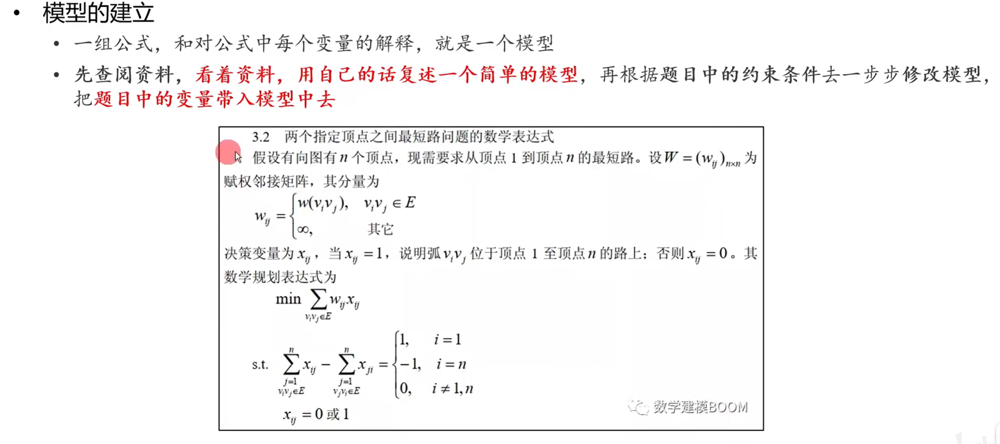

- 模型求解: 采用编程求解
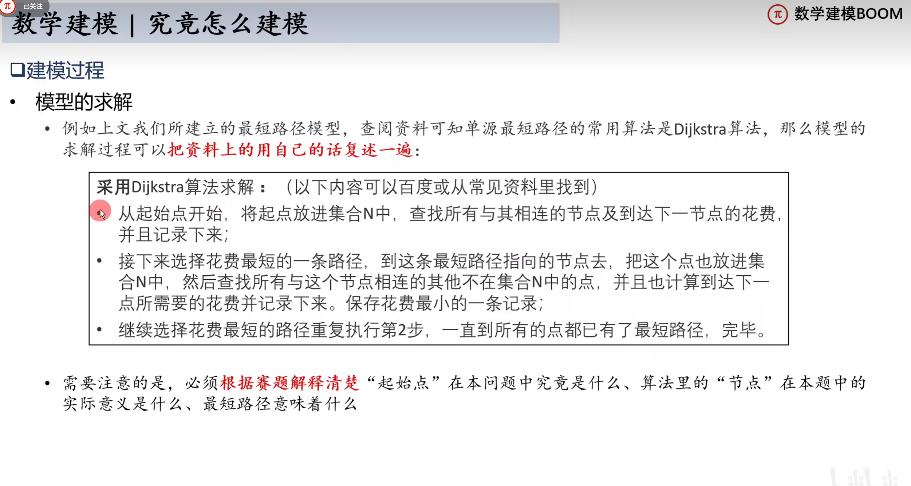

- 模型优缺点与改进方法: 非必要,写上最好,实在写不上可以不屑
- 参考文献: 知网中引用,选择第一个

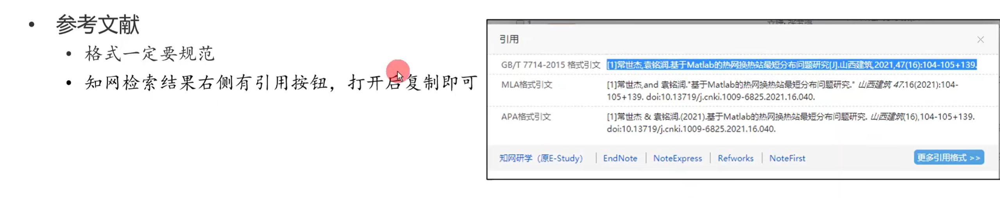

- 附录:别直接抄代码,变量名字换一换
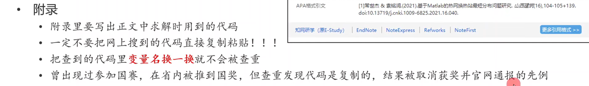

## 3.排版
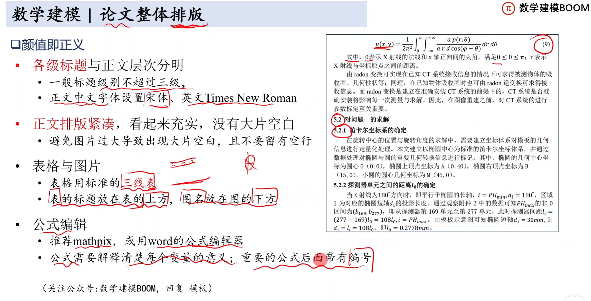
- 标题一般不超过三级
- 中文设置宋体
- 表格用三线表
- 表的标题放在表的上方，图片名字放在图片的下方。
- 重要公式加编号，每个公式加解释说明

## 4.标题
- 格式：基于xxx模型/算法的xxx问题的研究
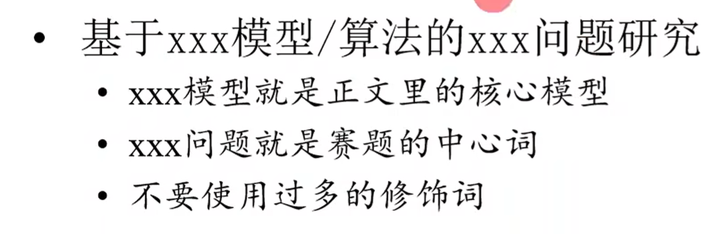
样例：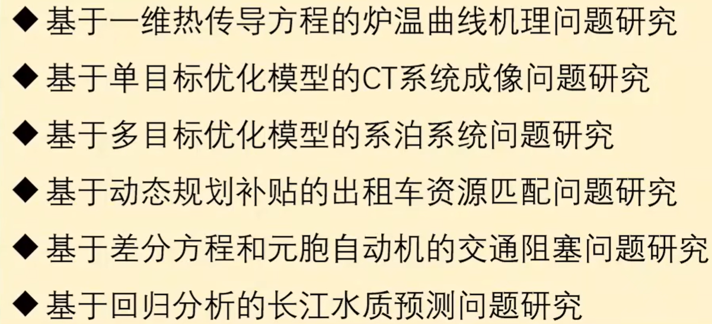

- 要求：读完标题，就能知道建立的是说明模型
  - 简明扼要，符合规范，便于检索
  - 字数限制在一行内
  - 不要写公式，非公知的缩写

## 5.摘要

- 基本要求
   - 是对论文的总结概括，
   - 让评阅老师读完摘要，就知道文本解决的问题，建立的模型和求解结果
- 注意事项
   - 不要加表格
   - 3/4页到1页，就差不多刚刚好一页，不要留太多空白
1. 开头
- 模板
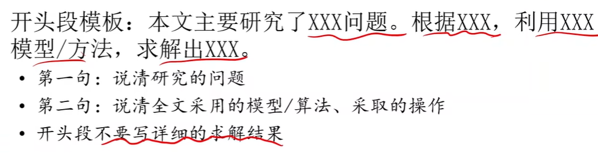
- 注意事项

   不要把求解过程完全写出来，留在后面写的

   示例：
   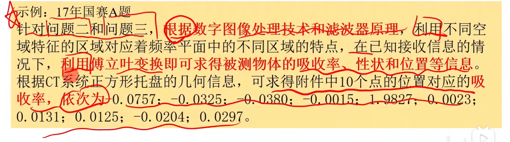

2. 中间
- 模板

- 注意事项+示例
   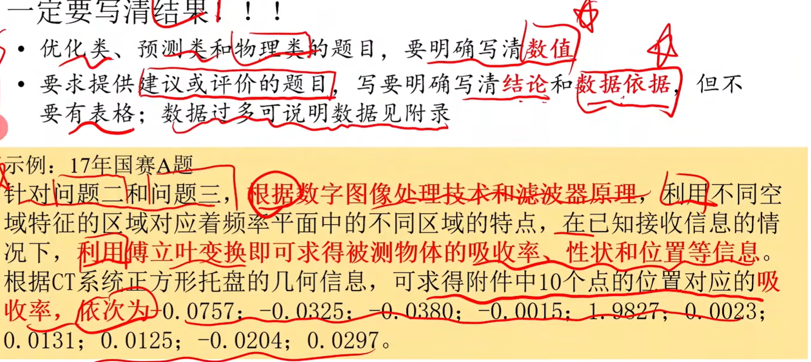

3. 总结
- 注意事项
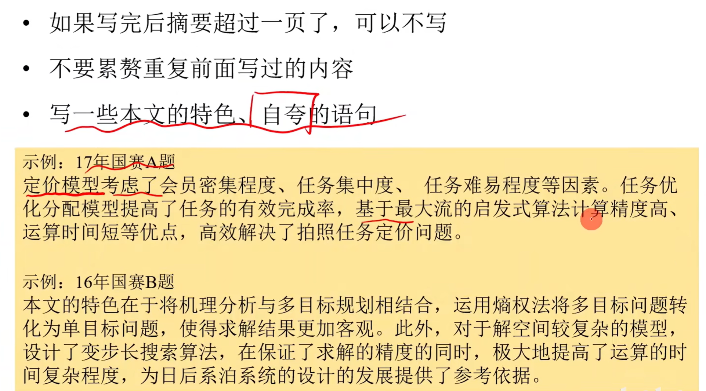

4. 关键字
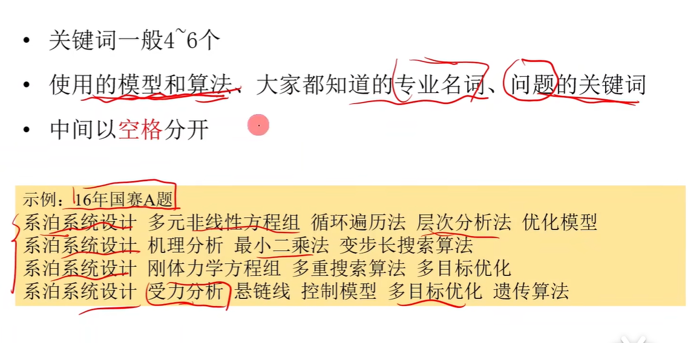

首先是预测模型
（1）神经网络预测模型
（2）灰色预测模型
（3）拟合插值预测（线性回归）
（4）时间序列模型
（5） 马尔科夫模型
（6）支持向量机模型
（7）Logistic模型
（8）组合预测模型
（9）微分方程预测
（10）组合预测模型
其次是评价模型
（1）模糊综合评价法
（2）层次分析法
（3）聚类分析法
（4）主成分分析评价法
（5）灰色综合评价法
（6）人工神经网络评价法
（7）BP神经网络综合评价法
（8）组合评价法
第三个是优化模型
（1）规划模型，其中包括目标规划、线性规划、非线性规划、整数规划、动态规划
（2）排队论模型
（3）神经网络模型
（4）现代优化算法，其中包括遗传算法、模拟退火算法、蚁群算法、禁忌搜索算法
（5）图论模型
（6） 组合优化模型
第四个是分类模型
（1）决策树
（2）逻辑回归
（3）随机森林
（4）朴素贝叶斯
最后统计统计分析模型有：
（1）均值T检验
（2）方差分析
（3）协方差分析
（4）分布检验
（5）相关分析
（6）卡方检验
（7）秩和检验
（8）回归分析
（9）Logistic回归
（10）聚类分析
（11）判别分析
（12）关联分析
第二部分是十大算法
1、蒙特卡罗算法
2、数据拟合、参数估计、插值等数据处理算法
3、线性规划、整数规划、多元规划、二次规划等规划类问题
4、图论算法
5、动态规划、回溯搜索、分治算法、分支定界等计算机算法
6、最优化理论的三大非经典算法：模拟退火法、神经网络、遗传算法
7、网格算法和穷举法
8、一些连续离散化方法
9、数值分析算法
10、图象处理算法

