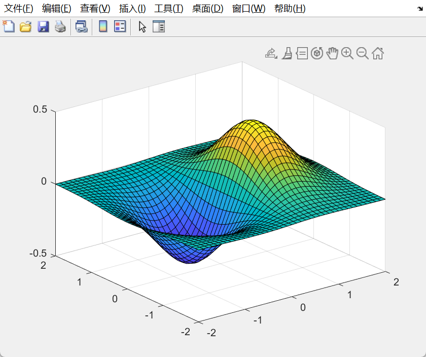
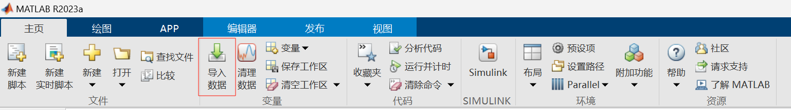
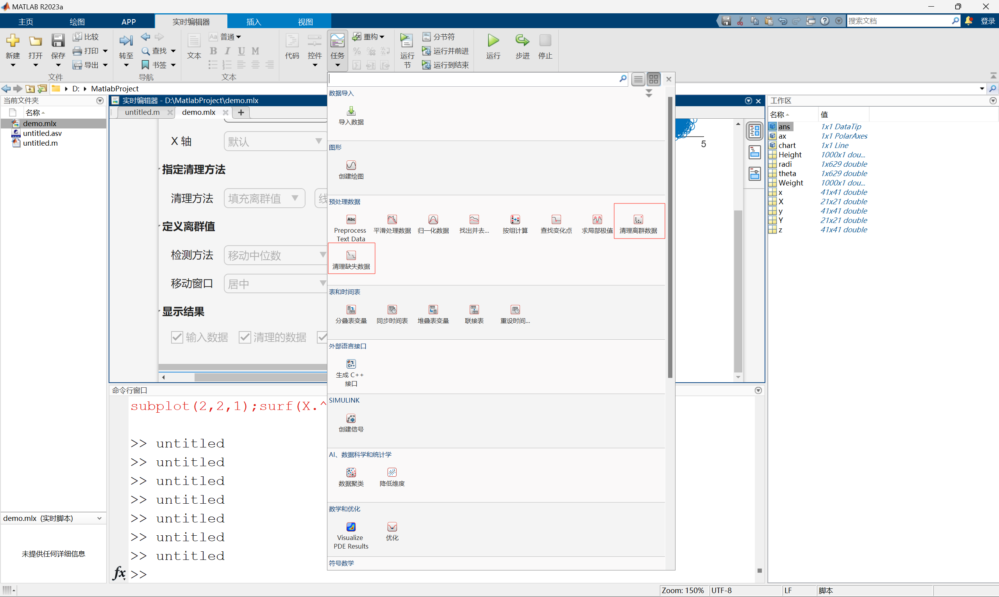
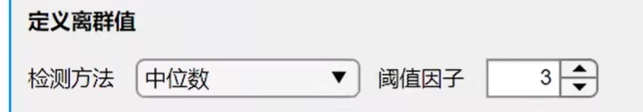

## rand
1. ***rand(m,n)***: 均匀分布的随机数
2. ***rand(m,n,double)***: 指定精度的随机数
3. ***rand(RandStream,m,n)***: 指定种子的随机数
**分布在0和1之间**
## randn
正太分布随机数

*用法与上述一样*

***方差为1,均值为0***
## randi

均匀分布的伪随机整数

1. ***rand(iMax)***：在区间(0,iMax)的随机整数
2. ***randi(iMax,m,n)***：m*n型在区间(0,iMax)的随机整数
3. ***rand([iMin,iMax],m,n)***: m*n型在区间(iMin,iMax)的随机整数

## 元胞数组
***cell(m,n)***：
m\*n的**结构体**(相当于一个盒子)

## eye
***eye(m)***
:n阶单位矩阵

## 幻方
***magic(n)***:
n阶幻方,对角线横竖和都相同

和为
$$n\times(n^2+1)/2$$

## 矩阵

$A = [1,2,3,4,5,6,7,8,9]$

$B=1:2:9$
(1,3,5,7,9)
$B=1:3:9$(1,4,7)

C=repmat(B,m,n)
行上重复m次 列上重复n次

m行 n列

$\qquad$B B B

$\qquad$B B B

***ones(m,n)***:m行n列全1矩阵

***矩阵四则运算***

$C=A+B$

$C=A-B$

$B'$ 转置

$C=A*B'$ 矩阵相乘

$C=A.*B$ 矩阵对应项相乘

$C=A/B=A*inv(B)$

$C=A./B$ 对应项相除

***矩阵的下标***

$A=magic(5)$

$B=A(3,2)$ 3
行2列

$B=A(3,:)$ 第三行

$B=a(:,3)$ 第三列
$$
[m,n]=find(A>20)
$$
寻找矩阵A中大于20的值并返回下标[m,n]
会有多组

## 循环
for 循环变量 = 初值:步长:终值(省略步长默认值为1)

$\qquad$ 循环语句1

$\qquad$ 循环语句2

end

while 条件表达式

$\qquad$执行语句1

$\qquad$执行语句2

end
## 分支语句
if 条件表达式

$\qquad$表达式1

$\qquad$表达式2

$\qquad$...

end

if 条件表达式

$\qquad$表达式1

$\qquad$表达式2

$\qquad$...

$\qquad$else

$\qquad$表达式1

$\qquad$表达式2

$\qquad$...

end

switch 表达式

$\qquad$case 数值或字符串

$\qquad$$\qquad$语句1；

$\qquad$case 数值或字符串

$\qquad$$\qquad$语句2；

$\qquad$case 数值或字符串

$\qquad$$\qquad$语句3；

$\qquad$otherwise
        语句体;

end

## 二维平面绘图

1.连线图 

x=0:0.01:2pi;  ***pi表示pai***

y=sin(x);

figure ***建立一个幕布***

plot(x,y) ***绘制图像***

title('y=sin(x)') ***标题***

xlabel('x') ***x轴标签***

ylabel('sin(x)') ***y轴标签***

xlim([0,2*pi]) ***限制x轴范围***

[AX,H1,H2]=plotyy(x,y1,x,y2,'plot');  ***多个图像共用一个坐标系***$\qquad$***返回AX中创建的<u>两个坐标轴的句柄</u>以及H1和H2中每个<u>图像对应的句柄</u>***

set(get(AX(1),'Ylabel'),'string','Slow Decay')

set(get(AX(2),'Ylabel'),'string','Fast Decay')

set(H1,'LineStyle','--')

set(H2,'LineStyle',':' )

2.条形图

bar绘制条形图

3.极坐标图

polarplot绘制极坐标图

4.散点图

scatter绘制散点图

## 三维立体绘图
1.三维曲面图

[x,y]=meshgrid(-2:0.2:2);

z=x.*exp(-x.^2-y.^2);

surf(x,y,z)

colormap hsv

colormap用于设置颜色模型，一般用hsv，也有winter，summer
     
2.子图

可以在一个图中画多个图像

    [X, Y] = meshgrid(-2:0.2:2);
    theta = 0:0.01:2*pi;
    radi = abs(sin(2*theta).*cos(2*theta));
    Height = randn(1000,1);
    Weight = randn(1000,1);
    subplot(2,2,1);surf(X.^2);title('1st');
    subplot(2,2,2);surf(Y.^3);title('2nd');
    subplot(2,2,3);polarplot(theta,radi);title('3rd');
    subplot(2,2,4);scatter(Height,Weight);title('4th');
    colormap hsv;

subplot(2,2,1)

前两个数指定大小，第三个数指定编号。

## 导入数据

matlab导入中ctrl是多选。

工作区的数据可以保存

## 处理缺失值和异常值

- 处理缺失值和异常值入口（必须在实时编辑模式中）

- 处理异常值的阈值因子

即检测方法对应值 $\pm3$
