- [1. 基本理论知识](#1-基本理论知识)
  - [1.1. 基本概念术语](#11-基本概念术语)
    - [1.1.1. 数据相关部分概念](#111-数据相关部分概念)
    - [1.1.2. 数据结构](#112-数据结构)
  - [1.2. 复杂度](#12-复杂度)
  - [1.3. 顺序表](#13-顺序表)
    - [1.3.1. 查找](#131-查找)
    - [1.3.2. 插入](#132-插入)
    - [1.4. 删除](#14-删除)
  - [1.5. 单链表](#15-单链表)
    - [查找](#查找)
    - [插入](#插入)
  - [循环链表](#循环链表)
  - [线性表与链表性能比较](#线性表与链表性能比较)
  - [栈](#栈)
  - [队列](#队列)
  - [循环队列](#循环队列)
  - [哈希表（散列表）](#哈希表散列表)
    - [冲突的解决方法](#冲突的解决方法)
    - [查找](#查找-1)
    - [性质](#性质)
  - [做题知识](#做题知识)

# 1. 基本理论知识

## 1.1. 基本概念术语

### 1.1.1. 数据相关部分概念

- 数据：客观事物点击符号表示，比如某班学生信息
- 数据元素，组成数据的基本单位，比如一个学生信息
- 数据项，组成数据元素的最小单位，是不可分割的学生信息中的身高体重
- 数据对象，是数据的子集，是数据元素的一个集合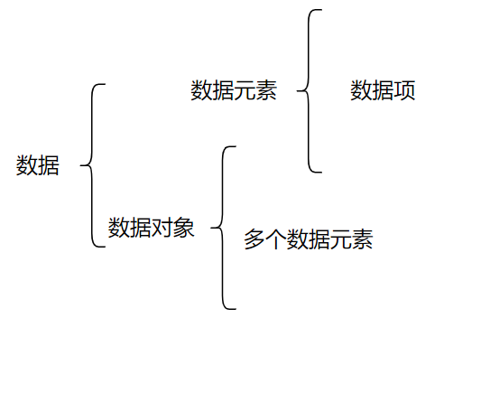

### 1.1.2. 数据结构

- 逻辑结构
  - 集合结构
  - 线性结构（包括链表和线性表）
  - 树状结构
  - 图状结构
- 存储结构
  - 顺序存储
  - 链式存储

## 1.2. 复杂度

- 时间复杂度
  - 分为最好，最坏，平均时间复杂度，一般下来讨论的都是最坏的时间复杂度
- 空间复杂度
  - 所占空和n的关系

## 1.3. 顺序表

### 1.3.1. 查找

- 平均查找长度（Average Search Length，ASL）：
为确定元素位置，需要和给定值进行比较的元素个数的期望值

$$
ASL = \sum_{i=1}^{n} P_i \cdot i
$$
可以简化为
$$
    ASL=\frac{1}{n} \sum_{i=1}^{n} i=\frac{n+1}{2}
$$

### 1.3.2. 插入

- $E_ins$表示插入操作的移动元素的期望值

$$
    E_{ins}= \sum_{i=1}^{n+1} P_i \cdot {n+1-i}
$$

假设每个元素插入的概率相等，那么
$$
E_{ins}=\frac{n}{2}
$$

### 1.4. 删除

$$
E_{del}=\sum_{i=1}^{n}p_i(n-i)
$$

$$
E_{del}=\frac{n-1}{2}
$$

## 1.5. 单链表

### 查找

$$
E_{search}=(n+1)/2
$$

### 插入

- 时间复杂度为O(n),因为要查找道地n个元素再删除

## 循环链表

- 基本没有区别，唯一区别在于判空条件变为P!=L(头结点)

## 线性表与链表性能比较

- 空间
  - 线性表的存储密度为1，链表的存储密度小于1
- 时间
  - 插入和删除，链表为O(1)，线性表为O(n)

## 栈

- 跳过🍾

## 队列

- 假溢出：假设队列空间为6，一般规定初始front=rear=0，插入元素后，rear++，也就是说rear指向的始终是下一个元素的位置，当rear==5的时候，实际上只有5个元素，此时不可再插入了，如果再插入就会导致越界访问
- 解决方法：循环队列，rear=(rear+1)%n

## 循环队列

- 队列长度(rear-front+MAXSIZE)%MAXSIZE

## 链队列
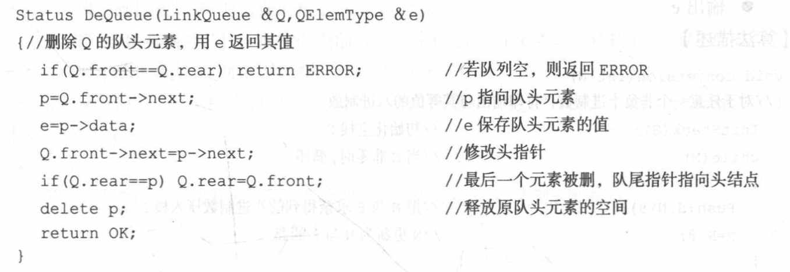
- 使用了dummynode，Q.front不代表任何值，Q.front->next才是第一个元素
- Q.front->next代表第一个元素和Q.rear代表最后一个元素，两者都是指代一个链表上节点的指针
- 正常来说，删除节点只删除对头的节点，但是队头节点和队尾节点相等的时候，就是只剩下了一个元素，这时候再删除就把队尾的给删除了，队尾指针指向的内存给删了，如何判断呢，当Q->next==Q.rear的时候代表只剩下了一个元素，此时要删的时候需要delete Q->next,然后Q.rear=Q.front。此时就是判空的条件成立
## 哈希表（散列表）

### 冲突的解决方法

- 开放地址发：线性探测，二次探测，伪随机探测法（二次探测法为$-1,-1^2,2^2,-2^2...$这样的，每次都是相对于元addr,比如5冲突了，那就是6，4，9，1）
- 链式地址法：将冲突的元素放在一个链表中，数组存放的头节点的地址

### 查找

1. 计算addr（key%m）
2. 如果addr为空，元素不存在
3. 如果addr不为空，且key相等，找到
4. 如果addr不为空，且key不相等，执行以下步骤

- 按上述解决冲突的方法，计算下一个散列地址
- 如果下一个散列地址为空，元素不存在
- 如果下一个散列地址不为空，且key相等，找到
- 注意，要加个计数器，如果计数器大于数组长度，说明数组已满，无法插入或者从头开始遍历，直到找到空位置

### 性质

- 填装因子：$\frac{填入表中的元素}{表总长度}$
## 串
- 空格串和空串分开
- 串的模式匹配/串匹配：在主串中找到子串的位置
- 子串也叫做模式串（模式）
- 空串是由0个字符组成的串，空格串是由若干个空格组成的串
## 做题知识

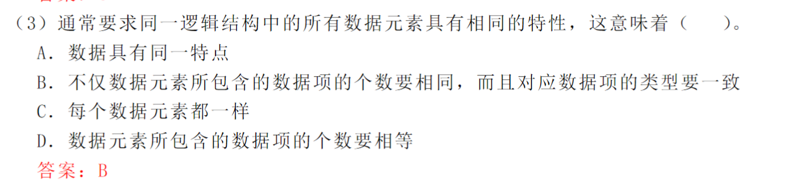
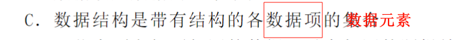
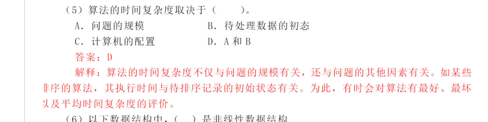
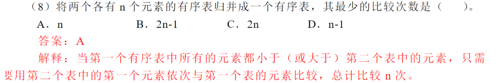
n或者1
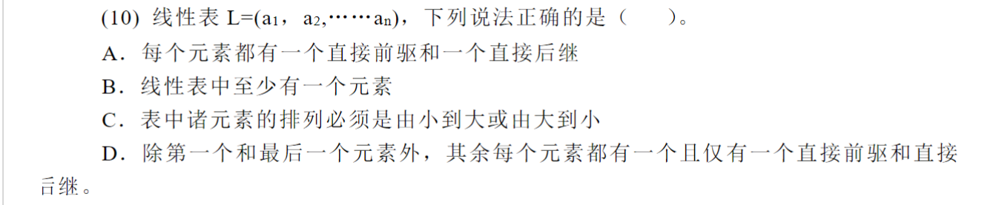

注意D，有且仅有一个前继和后驱（是和不是或，除了开头和结尾只有一个）

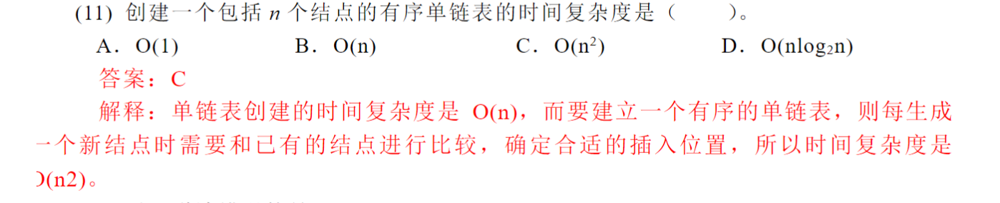
意是有序的，单纯的单链表是O(n),但要有序的话还要考虑插入位置，所以是O(n2)

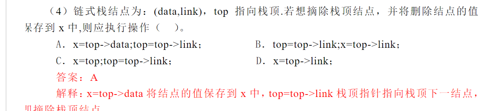
top->link出栈

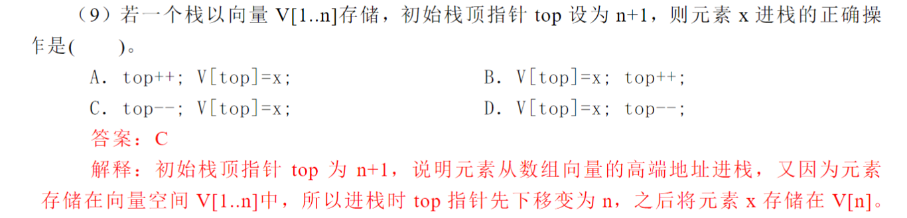
栈顶不一定从0开始，也可以从n开始（向量就是数组，[1,,n]表示下标范围）

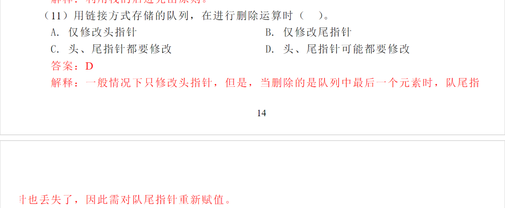
ababaabab
123456789
011234234
xaababbab
010104101
