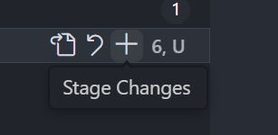

# 查漏补缺

stage change的作用就是add


```shell
git config core.ignoreCase false
```
这句作用是设置大小写敏感，即不忽略大小写

```shell

# reset

- soft在想回去再添加的一个文件的时候使用。即提交记录中少了add一个文件，那么回去把那个文件add
- mixed在多添加文件的时候使用，回去的时候，原来add的不在了，回去再把需要的文件给add再commit
- 没有本质区别，因为已经add的还可以取消add，相当于soft=mixed+add全部文件。
